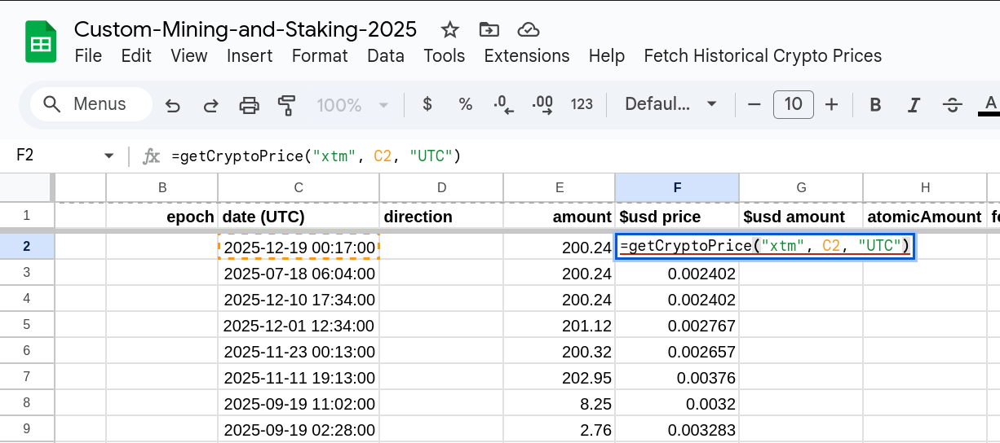

# Fetch Crypto Price from Centralized Exchange

## Overview

**USE AT YOUR OWN RISK: SEE LICENSE FILE IN PARENT DIRECTORY.**

This directory contains utilities for fetching historical
cryptocurrency prices from centralized exchanges (CEXs).
These tools are designed for tokens that don't trade on
decentralized exchanges, such as Bitcoin (BTC), Monero (XMR),
and Tari (XTM).

Unlike DEX-traded tokens (which can be priced via DexScreener
or DexTools APIs), CEX-traded tokens require querying exchange
APIs like MEXC, with fallbacks to CoinGecko and CoinPaprika.

## Tools

This directory contains two separate implementations for
different use cases:

| Tool                   | Use Case                | Capacity             |
|------------------------|-------------------------|----------------------|
| **Google Apps Script** | Google Sheets           | ~100 calls per run   |
| **Node.js CLI**        | Batch processing CSVs   | Thousands of rows    |

---

### 1. Google Apps Script (`getCryptoPriceFromCentralizedExchange.gs`)

A custom `=getCryptoPrice()` function for Google Sheets with
multi-provider fallback (MEXC, CoinGecko, CoinPaprika),
caching, and rate-limit protection.

For detailed usage, configuration, and data-source
documentation, see the file header in
[`getCryptoPriceFromCentralizedExchange.gs`](./getCryptoPriceFromCentralizedExchange.gs).

---

### 2. Node.js CLI (`crypto-price-filler/`)

A command-line tool for batch processing CSV files with
thousands of timestamps, using the same multi-provider
fallback chain.

For detailed documentation, see the file header in
[`crypto-price-filler/index.js`](./crypto-price-filler/index.js)
and
[`crypto-price-filler/README.md`](./crypto-price-filler/README.md).

---

## Sample Output

### Google Sheets

### The Additional CSV of Analyitics Data That The NodeJS Implementation Produces

## Supported Tokens

Both tools support the same set of tokens. Configuration is
maintained in:

- **GAS:** `TOKEN_TO_ID` constant in the `.gs` file
- **Node.js:** `supported-tokens.json`

Current tokens: BTC, XMR, GRC, XTM (and any token listed on
MEXC)

## Contributing

Contributions welcome! Fork on GitHub and submit a pull
request.

**Requirements:**

- All tests must pass
- Code must maintain low cyclomatic complexity (~17 max)
- New features should include tests

## Authors

Christopher M. Balz, with Grok and Claude
