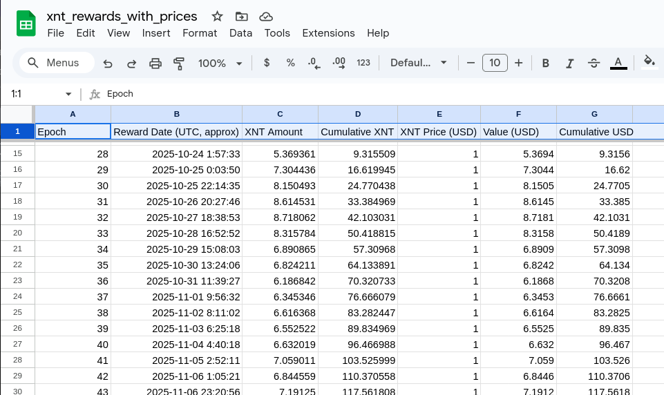
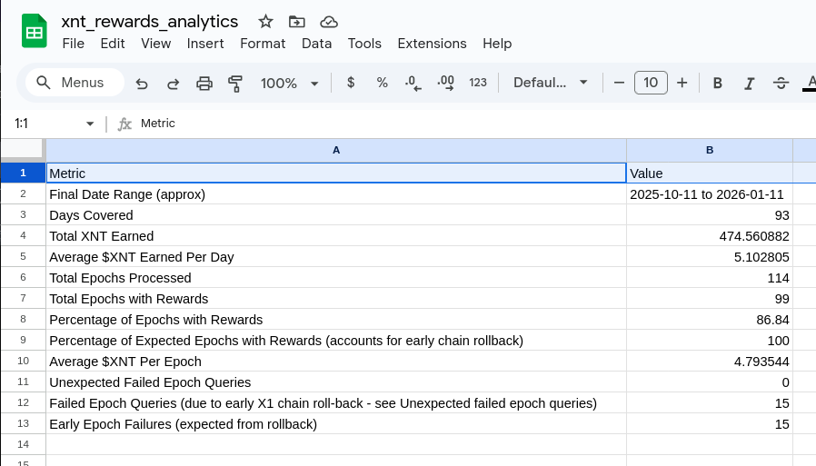

# Fetch Crypto Price from Centralized Exchange

## Overview

**USE AT YOUR OWN RISK: SEE LICENSE FILE IN PARENT DIRECTORY.**

This directory contains utilities for fetching historical cryptocurrency prices from centralized exchanges (CEXs). These tools are designed for tokens that don't trade on decentralized exchanges, such as Bitcoin (BTC), Monero (XMR), and Tari (XTM).

Unlike DEX-traded tokens (which can be priced via DexScreener or DexTools APIs), CEX-traded tokens require querying exchange APIs like MEXC, with fallbacks to CoinGecko and CoinPaprika.

## Tools

This directory contains two separate implementations for different use cases:

| Tool | Use Case | Capacity |
|------|----------|----------|
| **Google Apps Script** | Google Sheets integration | ~100 calls per run |
| **Node.js CLI** | Batch processing CSV files | Thousands of rows |

---

### 1. Google Apps Script (`getCryptoPriceFromCentralizedExchange.gs`)

A custom function for Google Sheets that fetches historical prices directly in your spreadsheet.

**Features:**
- Custom `=getCryptoPrice()` function for use in cells
- Multi-provider fallback chain: MEXC → CoinGecko → CoinPaprika
- Aggressive caching (24h for prices, 5min for failures)
- Rate-limit protection with automatic retry and exponential backoff
- Menu action to refresh and freeze all prices as static values

**Usage in Google Sheets:**
```
=getCryptoPrice("btc", "2026-01-15 14:30:00", "CST", "high")
=getCryptoPrice("xmr", A1, "UTC", "low")
```

**Installation:**
1. Open your Google Sheet
2. Go to **Extensions → Apps Script**
3. Paste the contents of `getCryptoPriceFromCentralizedExchange.gs`
4. Save and refresh your sheet

**Testing:**
In the Apps Script editor, select `test` from the function dropdown and click **Run**.

**Limitations:**
- Google Apps Script execution limits (~100 API calls per run)
- For larger datasets, use the Node.js CLI instead

---

### 2. Node.js CLI (`crypto-price-filler/`)

A command-line tool for batch processing CSV files with thousands of timestamps.

**Features:**
- Reads timestamps from input CSV, outputs prices to new CSV
- Same multi-provider fallback chain as the GAS version
- Backfill utility for filling gaps in existing price data
- Configurable via `config.json` and `supported-tokens.json`
- Full test suite with coverage reporting

**Quick Start:**
```bash
cd crypto-price-filler
npm install
node index.js --token=grc --input=timestamps.csv --output=prices.csv
```

**Backfill existing data:**
```bash
node backfill.js --input=output.csv --backfill-highest
```

See [`crypto-price-filler/README.md`](./crypto-price-filler/README.md) for complete documentation.

---

## Sample Output




## Supported Tokens

Both tools support the same set of tokens. Configuration is maintained in:
- **GAS:** `TOKEN_TO_ID` constant in the `.gs` file
- **Node.js:** `supported-tokens.json`

Current tokens: BTC, XMR, GRC, XTM (and any token listed on MEXC)

## Contributing

Contributions welcome! Fork on GitHub and submit a pull request.

**Requirements:**
- All tests must pass
- Code must maintain low cyclomatic complexity (~17 max)
- New features should include tests

## Authors

Christopher M. Balz, with Grok and Claude
